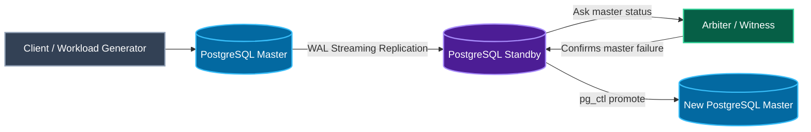
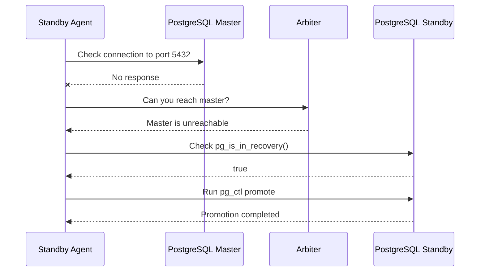
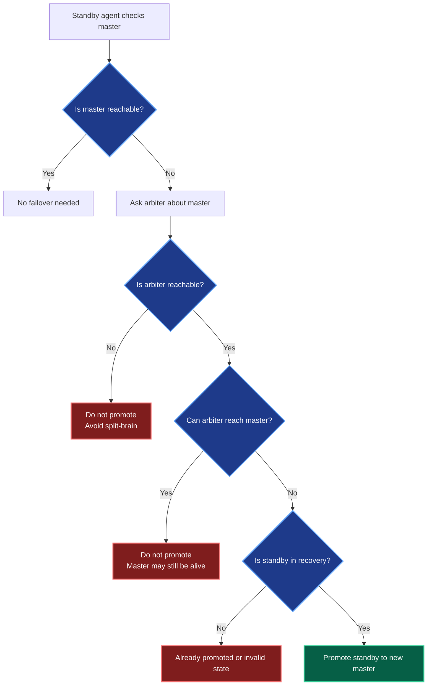
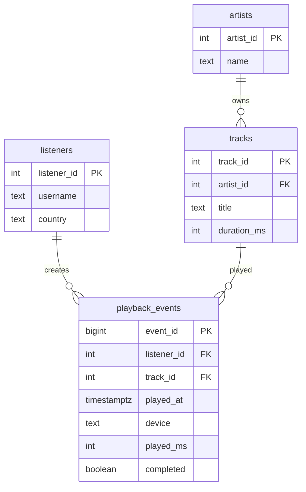
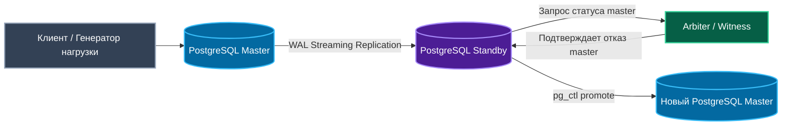
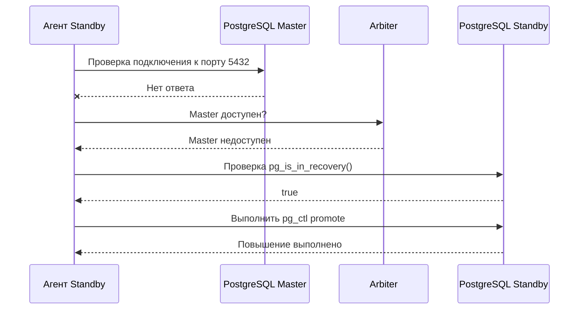
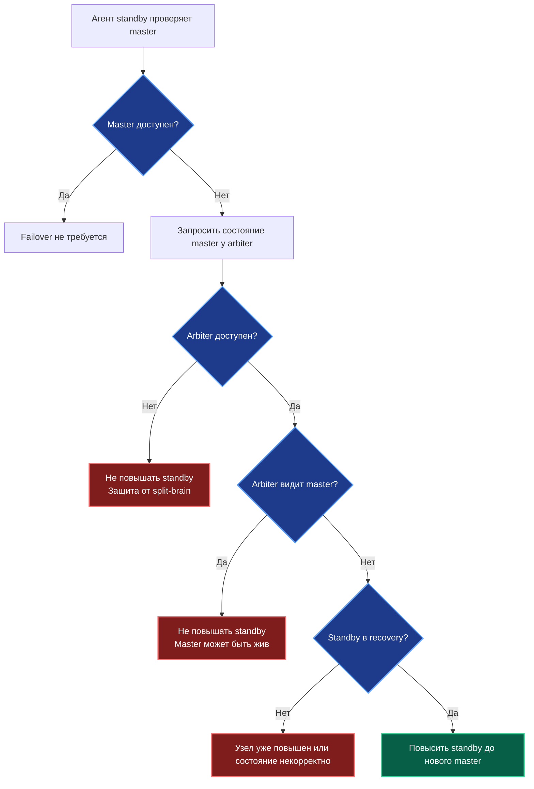
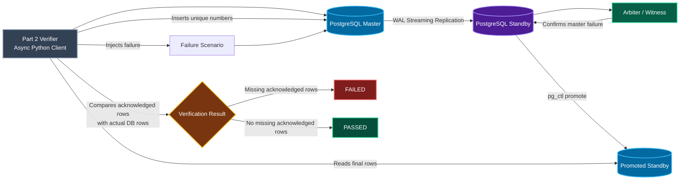
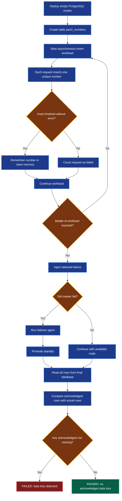
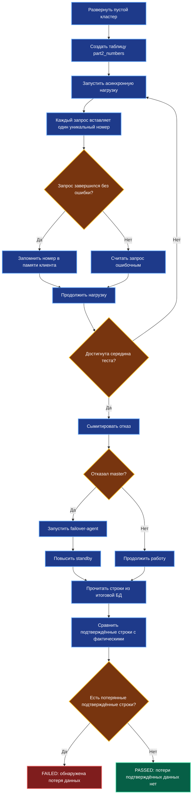

# MusicDB Failover Test

<p align="center">
  <b>PostgreSQL fault-tolerance laboratory project for a music streaming database</b><br>
  <b>Лабораторный проект по отказоустойчивости PostgreSQL для базы данных музыкального стриминга</b>
</p>

<p align="center">
  
  
  
  
</p>

---

## Language / Язык

| Language | Section |
|---|---|
| English | [English Version](#english-version) |
| Русский | [Русская версия](#русская-версия) |

---

# English Version

## 1. Project Theme

**Testing DBMS node failure in a music streaming system**

This project demonstrates a PostgreSQL fault-tolerance scenario for a simplified music streaming database.

The system contains:

| Object | Meaning |
|---|---|
| Listeners | Users of the music streaming service |
| Artists | Music creators |
| Tracks | Songs stored in the platform |
| Playback events | Synthetic listening events used as database workload |

The main purpose is to test how the database behaves when the main PostgreSQL node fails.

---

## 2. Project Mission

The mission is to build a small PostgreSQL cluster with:

| Node | Container | Role |
|---|---|---|
| Master | `pg_master` | Main writable PostgreSQL node |
| Standby | `pg_standby` | Replica that receives WAL changes |
| Arbiter | `pg_arbiter` | Witness node that helps decide whether failover is safe |

When the master fails, the standby must become the new master only after the arbiter confirms that the original master is unreachable.

This prevents **split-brain**, where two PostgreSQL nodes both become writable masters.

---

## 3. Architecture Diagram



---

## 4. Failover Sequence Diagram



---

## 5. Failover Decision Diagram



---

## 6. Database Model Diagram



---

## 7. Safe Promotion Rules

| Situation | Arbiter Result | Action |
|---|---|---|
| Standby cannot reach master | Arbiter also cannot reach master | Promote standby |
| Standby cannot reach master | Arbiter can reach master | Do not promote |
| Standby cannot reach master | Arbiter is unavailable | Do not promote |
| Master is reachable | Any | Do not promote |
| Standby is already promoted | Any | Do not promote again |

---

## 8. Technology Stack

| Technology | Purpose |
|---|---|
| PostgreSQL 16 | Database management system |
| Docker | Container runtime |
| Docker Compose | Multi-container cluster setup |
| Python 3.12 | Arbiter and failover agent |
| Bash | Helper scripts |
| Mermaid | Diagrams in README |
| GitHub | Source code hosting |

---

## 9. Repository Structure

```text
musicdb-failover-test/
├── README.md
├── docker-compose.yml
├── agent/
│   └── agent.py
├── assets/
│   └── banner.svg
├── docker/
│   ├── master/
│   │   └── init/
│   │       ├── 00-configure-master.sh
│   │       └── 01-music-schema.sql
│   └── standby/
│       └── standby-entrypoint.sh
└── scripts/
    ├── reset.sh
    ├── status.sh
    ├── test_failover.sh
    └── workload.sh
```

---

## 10. Services and Ports

| Service | Container Name | Host Port | Container Port | Purpose |
|---|---|---:|---:|---|
| PostgreSQL Master | `pg_master` | `5432` | `5432` | Primary database |
| PostgreSQL Standby | `pg_standby` | `5433` | `5432` | Replica database |
| Arbiter | `pg_arbiter` | `8000` | `8000` | Witness service |

---

## 11. Installation on Debian

Install required tools:

```bash
sudo apt update
sudo apt install -y git docker.io docker-compose-plugin python3
sudo systemctl enable --now docker
```

Allow the current user to use Docker without `sudo`:

```bash
sudo usermod -aG docker $USER
newgrp docker
```

Check versions:

```bash
git --version
docker --version
docker compose version
python3 --version
```

---

## 12. Start the Cluster

```bash
docker compose up -d
```

Check containers:

```bash
docker compose ps
```

Expected containers:

```text
pg_master
pg_standby
pg_arbiter
```

Check database and replication status:

```bash
./scripts/status.sh
```

---

## 13. Generate Synthetic Workload

Write playback events to the master database:

```bash
./scripts/workload.sh master 10
```

This simulates users listening to music from different devices.

| Device Type | Examples |
|---|---|
| Mobile | iOS, Android |
| Browser | Web |
| Smart device | Smart speaker |

---

## 14. Run Failover Test

```bash
./scripts/test_failover.sh
```

The test performs the following steps:

| Step | Action |
|---:|---|
| 1 | Insert playback events into master |
| 2 | Stop the master container |
| 3 | Run the failover agent |
| 4 | Ask arbiter to verify master failure |
| 5 | Promote standby |
| 6 | Insert new events into promoted standby |

Expected important output:

```text
Arbiter also cannot reach master. Promotion is safe.
Standby promotion command executed.
```

---

## 15. Verify Promotion

Check whether the standby is still in recovery mode:

```bash
docker exec -u postgres pg_standby psql -U postgres -d musicdb -c "SELECT pg_is_in_recovery();"
```

Expected result after promotion:

```text
f
```

Meaning:

| Result | Meaning |
|---|---|
| `t` | Node is still standby |
| `f` | Node is promoted and writable |

Test write operation:

```bash
docker exec -u postgres pg_standby psql -U postgres -d musicdb -c \
"INSERT INTO playback_events(listener_id, track_id, device, played_ms, completed)
 VALUES (1, 1, 'web', 120000, true);"
```

---

## 16. Useful Commands

| Command | Description |
|---|---|
| `docker compose up -d` | Start the cluster |
| `docker compose ps` | Show containers |
| `docker compose logs` | Show logs |
| `./scripts/status.sh` | Show replication status |
| `./scripts/workload.sh master 10` | Generate load on master |
| `./scripts/workload.sh standby 10` | Generate load on promoted standby |
| `./scripts/test_failover.sh` | Run failover test |
| `./scripts/reset.sh` | Remove containers and volumes |

---

## 17. Troubleshooting

### Docker permission denied

Error:

```text
permission denied while trying to connect to the Docker daemon socket
```

Fix:

```bash
sudo usermod -aG docker $USER
newgrp docker
docker ps
```

### No such container: pg_master

This means the cluster is not running.

Fix:

```bash
docker compose up -d
docker compose ps
```

### Standby was not promoted

Check arbiter:

```bash
curl http://127.0.0.1:8000/health
```

Check logs:

```bash
docker compose logs --tail=100
```

---

## 18. Expected Result

After the failover test:

| Component | Expected State |
|---|---|
| Master | Stopped |
| Standby | Promoted to new master |
| Arbiter | Confirms master failure |
| Workload | Continues on promoted standby |
| Database | Contains playback events before and after failover |

The project proves that PostgreSQL standby can become a writable master after a primary node failure when the arbiter confirms that promotion is safe.

---

# Русская версия

## 1. Тема проекта

**Тестирование отказа узла СУБД музыкального стриминга**

Проект демонстрирует сценарий отказоустойчивости PostgreSQL для упрощённой базы данных музыкального стриминга.

Система содержит:

| Объект | Значение |
|---|---|
| Слушатели | Пользователи музыкального сервиса |
| Исполнители | Авторы музыкальных треков |
| Треки | Песни, доступные в системе |
| События прослушивания | Синтетические события нагрузки |

Главная цель — проверить поведение базы данных при отказе основного узла PostgreSQL.

---

## 2. Миссия проекта

Миссия проекта — построить небольшой кластер PostgreSQL из трёх логических узлов:

| Узел | Контейнер | Роль |
|---|---|---|
| Master | `pg_master` | Основной узел PostgreSQL для записи |
| Standby | `pg_standby` | Реплика, получающая WAL-изменения |
| Arbiter | `pg_arbiter` | Узел-свидетель для принятия решения о failover |

Если master выходит из строя, standby должен стать новым master только после подтверждения от arbiter.

Это предотвращает ситуацию **split-brain**, когда два узла PostgreSQL одновременно становятся доступными для записи.

---

## 3. Диаграмма архитектуры



---

## 4. Диаграмма последовательности Failover



---

## 5. Диаграмма принятия решения



---

## 6. Диаграмма модели базы данных


---

## 7. Правила безопасного повышения

| Ситуация | Результат Arbiter | Действие |
|---|---|---|
| Standby не видит master | Arbiter тоже не видит master | Повысить standby |
| Standby не видит master | Arbiter видит master | Не повышать |
| Standby не видит master | Arbiter недоступен | Не повышать |
| Master доступен | Любой | Не повышать |
| Standby уже повышен | Любой | Не повышать повторно |

---

## 8. Используемые технологии

| Технология | Назначение |
|---|---|
| PostgreSQL 16 | Система управления базами данных |
| Docker | Среда запуска контейнеров |
| Docker Compose | Запуск нескольких контейнеров |
| Python 3.12 | Arbiter и failover-agent |
| Bash | Вспомогательные скрипты |
| Mermaid | Диаграммы в README |
| GitHub | Хранение исходного кода |

---

## 9. Структура репозитория

```text
musicdb-failover-test/
├── README.md
├── docker-compose.yml
├── agent/
│   └── agent.py
├── assets/
│   └── banner.svg
├── docker/
│   ├── master/
│   │   └── init/
│   │       ├── 00-configure-master.sh
│   │       └── 01-music-schema.sql
│   └── standby/
│       └── standby-entrypoint.sh
└── scripts/
    ├── reset.sh
    ├── status.sh
    ├── test_failover.sh
    └── workload.sh
```

---

## 10. Сервисы и порты

| Сервис | Контейнер | Порт хоста | Порт контейнера | Назначение |
|---|---|---:|---:|---|
| PostgreSQL Master | `pg_master` | `5432` | `5432` | Основная база данных |
| PostgreSQL Standby | `pg_standby` | `5433` | `5432` | Реплика базы данных |
| Arbiter | `pg_arbiter` | `8000` | `8000` | Узел-свидетель |

---

## 11. Установка на Debian

Установить необходимые инструменты:

```bash
sudo apt update
sudo apt install -y git docker.io docker-compose-plugin python3
sudo systemctl enable --now docker
```

Разрешить текущему пользователю использовать Docker без `sudo`:

```bash
sudo usermod -aG docker $USER
newgrp docker
```

Проверить версии:

```bash
git --version
docker --version
docker compose version
python3 --version
```

---

## 12. Запуск кластера

```bash
docker compose up -d
```

Проверить контейнеры:

```bash
docker compose ps
```

Ожидаемые контейнеры:

```text
pg_master
pg_standby
pg_arbiter
```

Проверить состояние базы данных и репликации:

```bash
./scripts/status.sh
```

---

## 13. Генерация синтетической нагрузки

Записать события прослушивания в master:

```bash
./scripts/workload.sh master 10
```

Это имитирует прослушивание музыки пользователями с разных устройств.

| Тип устройства | Примеры |
|---|---|
| Мобильное устройство | iOS, Android |
| Браузер | Web |
| Умное устройство | Smart speaker |

---

## 14. Запуск теста отказа

```bash
./scripts/test_failover.sh
```

Тест выполняет следующие шаги:

| Шаг | Действие |
|---:|---|
| 1 | Добавляет события прослушивания в master |
| 2 | Останавливает контейнер master |
| 3 | Запускает failover-agent |
| 4 | Запрашивает подтверждение отказа у arbiter |
| 5 | Повышает standby |
| 6 | Добавляет новые события в повышенный standby |

Ожидаемый важный вывод:

```text
Arbiter also cannot reach master. Promotion is safe.
Standby promotion command executed.
```

---

## 15. Проверка повышения Standby

Проверить, находится ли standby в режиме recovery:

```bash
docker exec -u postgres pg_standby psql -U postgres -d musicdb -c "SELECT pg_is_in_recovery();"
```

Ожидаемый результат после повышения:

```text
f
```

Значение:

| Результат | Значение |
|---|---|
| `t` | Узел всё ещё является standby |
| `f` | Узел повышен и доступен для записи |

Проверить операцию записи:

```bash
docker exec -u postgres pg_standby psql -U postgres -d musicdb -c \
"INSERT INTO playback_events(listener_id, track_id, device, played_ms, completed)
 VALUES (1, 1, 'web', 120000, true);"
```

---

## 16. Полезные команды

| Команда | Описание |
|---|---|
| `docker compose up -d` | Запустить кластер |
| `docker compose ps` | Показать контейнеры |
| `docker compose logs` | Показать логи |
| `./scripts/status.sh` | Показать состояние репликации |
| `./scripts/workload.sh master 10` | Создать нагрузку на master |
| `./scripts/workload.sh standby 10` | Создать нагрузку на повышенный standby |
| `./scripts/test_failover.sh` | Запустить тест отказа |
| `./scripts/reset.sh` | Удалить контейнеры и volumes |

---

## 17. Диагностика ошибок

### Ошибка Docker permission denied

Ошибка:

```text
permission denied while trying to connect to the Docker daemon socket
```

Исправление:

```bash
sudo usermod -aG docker $USER
newgrp docker
docker ps
```

### Ошибка No such container: pg_master

Это означает, что кластер ещё не запущен.

Исправление:

```bash
docker compose up -d
docker compose ps
```

### Standby не повысился

Проверить arbiter:

```bash
curl http://127.0.0.1:8000/health
```

Проверить логи:

```bash
docker compose logs --tail=100
```

---

## 18. Ожидаемый результат

После теста отказа:

| Компонент | Ожидаемое состояние |
|---|---|
| Master | Остановлен |
| Standby | Повышен до нового master |
| Arbiter | Подтвердил отказ master |
| Нагрузка | Продолжается на повышенном standby |
| База данных | Содержит события до и после failover |

Проект показывает, что standby-узел PostgreSQL может стать новым master-узлом для записи после отказа основного узла, если arbiter подтверждает безопасность повышения.

---

## License / Лицензия

Educational project for studying DBMS fault tolerance.

Учебный проект для изучения отказоустойчивости СУБД.
# MusicDB Failover Test

<p align="center">
  <b>PostgreSQL fault-tolerance laboratory project for a music streaming database</b><br>
  <b>Лабораторный проект по отказоустойчивости PostgreSQL для базы данных музыкального стриминга</b>
</p>

<p align="center">
  
  
  
  
</p>

---

## Language / Язык

| Language | Section |
|---|---|
| English | [English Version](#english-version) |
| Русский | [Русская версия](#русская-версия) |

---

# English Version

## 1. Project Theme

**Testing DBMS node failure in a music streaming system**

This project demonstrates a PostgreSQL fault-tolerance scenario for a simplified music streaming database.

The system contains:

| Object | Meaning |
|---|---|
| Listeners | Users of the music streaming service |
| Artists | Music creators |
| Tracks | Songs stored in the platform |
| Playback events | Synthetic listening events used as database workload |

The main purpose is to test how the database behaves when the main PostgreSQL node fails.

---

## 2. Project Mission

The mission is to build a small PostgreSQL cluster with:

| Node | Container | Role |
|---|---|---|
| Master | `pg_master` | Main writable PostgreSQL node |
| Standby | `pg_standby` | Replica that receives WAL changes |
| Arbiter | `pg_arbiter` | Witness node that helps decide whether failover is safe |

When the master fails, the standby must become the new master only after the arbiter confirms that the original master is unreachable.

This prevents **split-brain**, where two PostgreSQL nodes both become writable masters.

---

## 3. Architecture Diagram


---

## 4. Failover Sequence Diagram


---

## 5. Failover Decision Diagram


---

## 6. Database Model Diagram


---

## 7. Safe Promotion Rules

| Situation | Arbiter Result | Action |
|---|---|---|
| Standby cannot reach master | Arbiter also cannot reach master | Promote standby |
| Standby cannot reach master | Arbiter can reach master | Do not promote |
| Standby cannot reach master | Arbiter is unavailable | Do not promote |
| Master is reachable | Any | Do not promote |
| Standby is already promoted | Any | Do not promote again |

---

## 8. Technology Stack

| Technology | Purpose |
|---|---|
| PostgreSQL 16 | Database management system |
| Docker | Container runtime |
| Docker Compose | Multi-container cluster setup |
| Python 3.12 | Arbiter and failover agent |
| Bash | Helper scripts |
| Mermaid | Diagrams in README |
| GitHub | Source code hosting |

---

## 9. Repository Structure

```text
musicdb-failover-test/
├── README.md
├── docker-compose.yml
├── agent/
│   └── agent.py
├── assets/
│   └── banner.svg
├── docker/
│   ├── master/
│   │   └── init/
│   │       ├── 00-configure-master.sh
│   │       └── 01-music-schema.sql
│   └── standby/
│       └── standby-entrypoint.sh
└── scripts/
    ├── reset.sh
    ├── status.sh
    ├── test_failover.sh
    └── workload.sh
```

---

## 10. Services and Ports

| Service | Container Name | Host Port | Container Port | Purpose |
|---|---|---:|---:|---|
| PostgreSQL Master | `pg_master` | `5432` | `5432` | Primary database |
| PostgreSQL Standby | `pg_standby` | `5433` | `5432` | Replica database |
| Arbiter | `pg_arbiter` | `8000` | `8000` | Witness service |

---

## 11. Installation on Debian

Install required tools:

```bash
sudo apt update
sudo apt install -y git docker.io docker-compose-plugin python3
sudo systemctl enable --now docker
```

Allow the current user to use Docker without `sudo`:

```bash
sudo usermod -aG docker $USER
newgrp docker
```

Check versions:

```bash
git --version
docker --version
docker compose version
python3 --version
```

---

## 12. Start the Cluster

```bash
docker compose up -d
```

Check containers:

```bash
docker compose ps
```

Expected containers:

```text
pg_master
pg_standby
pg_arbiter
```

Check database and replication status:

```bash
./scripts/status.sh
```

---

## 13. Generate Synthetic Workload

Write playback events to the master database:

```bash
./scripts/workload.sh master 10
```

This simulates users listening to music from different devices.

| Device Type | Examples |
|---|---|
| Mobile | iOS, Android |
| Browser | Web |
| Smart device | Smart speaker |

---

## 14. Run Failover Test

```bash
./scripts/test_failover.sh
```

The test performs the following steps:

| Step | Action |
|---:|---|
| 1 | Insert playback events into master |
| 2 | Stop the master container |
| 3 | Run the failover agent |
| 4 | Ask arbiter to verify master failure |
| 5 | Promote standby |
| 6 | Insert new events into promoted standby |

Expected important output:

```text
Arbiter also cannot reach master. Promotion is safe.
Standby promotion command executed.
```

---

## 15. Verify Promotion

Check whether the standby is still in recovery mode:

```bash
docker exec -u postgres pg_standby psql -U postgres -d musicdb -c "SELECT pg_is_in_recovery();"
```

Expected result after promotion:

```text
f
```

Meaning:

| Result | Meaning |
|---|---|
| `t` | Node is still standby |
| `f` | Node is promoted and writable |

Test write operation:

```bash
docker exec -u postgres pg_standby psql -U postgres -d musicdb -c \
"INSERT INTO playback_events(listener_id, track_id, device, played_ms, completed)
 VALUES (1, 1, 'web', 120000, true);"
```

---

## 16. Useful Commands

| Command | Description |
|---|---|
| `docker compose up -d` | Start the cluster |
| `docker compose ps` | Show containers |
| `docker compose logs` | Show logs |
| `./scripts/status.sh` | Show replication status |
| `./scripts/workload.sh master 10` | Generate load on master |
| `./scripts/workload.sh standby 10` | Generate load on promoted standby |
| `./scripts/test_failover.sh` | Run failover test |
| `./scripts/reset.sh` | Remove containers and volumes |

---

## 17. Troubleshooting

### Docker permission denied

Error:

```text
permission denied while trying to connect to the Docker daemon socket
```

Fix:

```bash
sudo usermod -aG docker $USER
newgrp docker
docker ps
```

### No such container: pg_master

This means the cluster is not running.

Fix:

```bash
docker compose up -d
docker compose ps
```

### Standby was not promoted

Check arbiter:

```bash
curl http://127.0.0.1:8000/health
```

Check logs:

```bash
docker compose logs --tail=100
```

---

## 18. Expected Result

After the failover test:

| Component | Expected State |
|---|---|
| Master | Stopped |
| Standby | Promoted to new master |
| Arbiter | Confirms master failure |
| Workload | Continues on promoted standby |
| Database | Contains playback events before and after failover |

The project proves that PostgreSQL standby can become a writable master after a primary node failure when the arbiter confirms that promotion is safe.

---

# Русская версия

## 1. Тема проекта

**Тестирование отказа узла СУБД музыкального стриминга**

Проект демонстрирует сценарий отказоустойчивости PostgreSQL для упрощённой базы данных музыкального стриминга.

Система содержит:

| Объект | Значение |
|---|---|
| Слушатели | Пользователи музыкального сервиса |
| Исполнители | Авторы музыкальных треков |
| Треки | Песни, доступные в системе |
| События прослушивания | Синтетические события нагрузки |

Главная цель — проверить поведение базы данных при отказе основного узла PostgreSQL.

---

## 2. Миссия проекта

Миссия проекта — построить небольшой кластер PostgreSQL из трёх логических узлов:

| Узел | Контейнер | Роль |
|---|---|---|
| Master | `pg_master` | Основной узел PostgreSQL для записи |
| Standby | `pg_standby` | Реплика, получающая WAL-изменения |
| Arbiter | `pg_arbiter` | Узел-свидетель для принятия решения о failover |

Если master выходит из строя, standby должен стать новым master только после подтверждения от arbiter.

Это предотвращает ситуацию **split-brain**, когда два узла PostgreSQL одновременно становятся доступными для записи.

---

## 3. Диаграмма архитектуры


---

## 4. Диаграмма последовательности Failover


---

## 5. Диаграмма принятия решения


---

## 6. Диаграмма модели базы данных


---

## 7. Правила безопасного повышения

| Ситуация | Результат Arbiter | Действие |
|---|---|---|
| Standby не видит master | Arbiter тоже не видит master | Повысить standby |
| Standby не видит master | Arbiter видит master | Не повышать |
| Standby не видит master | Arbiter недоступен | Не повышать |
| Master доступен | Любой | Не повышать |
| Standby уже повышен | Любой | Не повышать повторно |

---

## 8. Используемые технологии

| Технология | Назначение |
|---|---|
| PostgreSQL 16 | Система управления базами данных |
| Docker | Среда запуска контейнеров |
| Docker Compose | Запуск нескольких контейнеров |
| Python 3.12 | Arbiter и failover-agent |
| Bash | Вспомогательные скрипты |
| Mermaid | Диаграммы в README |
| GitHub | Хранение исходного кода |

---

## 9. Структура репозитория

```text
musicdb-failover-test/
├── README.md
├── docker-compose.yml
├── agent/
│   └── agent.py
├── assets/
│   └── banner.svg
├── docker/
│   ├── master/
│   │   └── init/
│   │       ├── 00-configure-master.sh
│   │       └── 01-music-schema.sql
│   └── standby/
│       └── standby-entrypoint.sh
└── scripts/
    ├── reset.sh
    ├── status.sh
    ├── test_failover.sh
    └── workload.sh
```

---

## 10. Сервисы и порты

| Сервис | Контейнер | Порт хоста | Порт контейнера | Назначение |
|---|---|---:|---:|---|
| PostgreSQL Master | `pg_master` | `5432` | `5432` | Основная база данных |
| PostgreSQL Standby | `pg_standby` | `5433` | `5432` | Реплика базы данных |
| Arbiter | `pg_arbiter` | `8000` | `8000` | Узел-свидетель |

---

## 11. Установка на Debian

Установить необходимые инструменты:

```bash
sudo apt update
sudo apt install -y git docker.io docker-compose-plugin python3
sudo systemctl enable --now docker
```

Разрешить текущему пользователю использовать Docker без `sudo`:

```bash
sudo usermod -aG docker $USER
newgrp docker
```

Проверить версии:

```bash
git --version
docker --version
docker compose version
python3 --version
```

---

## 12. Запуск кластера

```bash
docker compose up -d
```

Проверить контейнеры:

```bash
docker compose ps
```

Ожидаемые контейнеры:

```text
pg_master
pg_standby
pg_arbiter
```

Проверить состояние базы данных и репликации:

```bash
./scripts/status.sh
```

---

## 13. Генерация синтетической нагрузки

Записать события прослушивания в master:

```bash
./scripts/workload.sh master 10
```

Это имитирует прослушивание музыки пользователями с разных устройств.

| Тип устройства | Примеры |
|---|---|
| Мобильное устройство | iOS, Android |
| Браузер | Web |
| Умное устройство | Smart speaker |

---

## 14. Запуск теста отказа

```bash
./scripts/test_failover.sh
```

Тест выполняет следующие шаги:

| Шаг | Действие |
|---:|---|
| 1 | Добавляет события прослушивания в master |
| 2 | Останавливает контейнер master |
| 3 | Запускает failover-agent |
| 4 | Запрашивает подтверждение отказа у arbiter |
| 5 | Повышает standby |
| 6 | Добавляет новые события в повышенный standby |

Ожидаемый важный вывод:

```text
Arbiter also cannot reach master. Promotion is safe.
Standby promotion command executed.
```

---

## 15. Проверка повышения Standby

Проверить, находится ли standby в режиме recovery:

```bash
docker exec -u postgres pg_standby psql -U postgres -d musicdb -c "SELECT pg_is_in_recovery();"
```

Ожидаемый результат после повышения:

```text
f
```

Значение:

| Результат | Значение |
|---|---|
| `t` | Узел всё ещё является standby |
| `f` | Узел повышен и доступен для записи |

Проверить операцию записи:

```bash
docker exec -u postgres pg_standby psql -U postgres -d musicdb -c \
"INSERT INTO playback_events(listener_id, track_id, device, played_ms, completed)
 VALUES (1, 1, 'web', 120000, true);"
```

---

## 16. Полезные команды

| Команда | Описание |
|---|---|
| `docker compose up -d` | Запустить кластер |
| `docker compose ps` | Показать контейнеры |
| `docker compose logs` | Показать логи |
| `./scripts/status.sh` | Показать состояние репликации |
| `./scripts/workload.sh master 10` | Создать нагрузку на master |
| `./scripts/workload.sh standby 10` | Создать нагрузку на повышенный standby |
| `./scripts/test_failover.sh` | Запустить тест отказа |
| `./scripts/reset.sh` | Удалить контейнеры и volumes |

---

## 17. Диагностика ошибок

### Ошибка Docker permission denied

Ошибка:

```text
permission denied while trying to connect to the Docker daemon socket
```

Исправление:

```bash
sudo usermod -aG docker $USER
newgrp docker
docker ps
```

### Ошибка No such container: pg_master

Это означает, что кластер ещё не запущен.

Исправление:

```bash
docker compose up -d
docker compose ps
```

### Standby не повысился

Проверить arbiter:

```bash
curl http://127.0.0.1:8000/health
```

Проверить логи:

```bash
docker compose logs --tail=100
```

---

## 18. Ожидаемый результат

После теста отказа:

| Компонент | Ожидаемое состояние |
|---|---|
| Master | Остановлен |
| Standby | Повышен до нового master |
| Arbiter | Подтвердил отказ master |
| Нагрузка | Продолжается на повышенном standby |
| База данных | Содержит события до и после failover |

Проект показывает, что standby-узел PostgreSQL может стать новым master-узлом для записи после отказа основного узла, если arbiter подтверждает безопасность повышения.

---
---

# Part 2 — Automated Failover Verification

## English Version

## 1. Purpose of Part 2

Part 2 extends the project from a manual PostgreSQL failover demonstration into an **automated verification system**.

The main verified property is:

> If an insert request received successful transaction commit confirmation, that inserted row must not be lost after database failure and recovery.

The verifier performs stress testing against the PostgreSQL cluster from Part 1. It sends many asynchronous insert requests, injects a failure in the middle of the test, waits for failover or recovery, and then compares:

| Source               | Meaning                                                     |
| -------------------- | ----------------------------------------------------------- |
| Client memory        | Numbers that were confirmed as successfully inserted        |
| Final database state | Numbers actually found in PostgreSQL after failure recovery |

Extra rows in the database are acceptable.

Missing rows that were already acknowledged as successful are **not acceptable**.

---

## 2. Part 2 Architecture



---

## 3. Verification Algorithm



---

## 4. Test Table

Part 2 uses a minimal table with one primary-key column:

```sql
CREATE TABLE part2_numbers (
    id BIGINT PRIMARY KEY
);
```

Each asynchronous request inserts exactly one unique number:

```sql
INSERT INTO part2_numbers(id) VALUES ($1);
```

| Element          | Purpose                               |
| ---------------- | ------------------------------------- |
| `id`             | Unique number inserted by one request |
| `PRIMARY KEY`    | Prevents duplicate accepted rows      |
| One-column table | Makes verification simple and strict  |

---

## 5. Failure Scenarios

The verifier can inject several failure scenarios.

| Failure Scenario            | Description                                           |
| --------------------------- | ----------------------------------------------------- |
| `master_crash`              | Kills the master PostgreSQL container using `SIGKILL` |
| `master_network_partition`  | Disconnects master from the Docker network            |
| `standby_network_partition` | Disconnects standby from the Docker network           |
| `arbiter_network_partition` | Disconnects arbiter from the Docker network           |

The main scenario for data-safety verification is:

```text
master_crash
```

This scenario checks whether acknowledged writes survive after the standby node is promoted.

---

## 6. synchronous_commit Verification Matrix

Part 2 verifies different PostgreSQL `synchronous_commit` modes.

| synchronous_commit | Expected Behavior                  |
| ------------------ | ---------------------------------- |
| `off`              | Data loss may be detected          |
| `local`            | Data loss may be detected          |
| `remote_write`     | No acknowledged data loss expected |
| `on`               | No acknowledged data loss expected |
| `remote_apply`     | No acknowledged data loss expected |

Unsafe modes are useful because the verifier should be able to expose possible data loss.

Safe modes are expected to pass when synchronous replication is configured correctly.

---

## 7. Part 2 Files

| File                      | Purpose                                                   |
| ------------------------- | --------------------------------------------------------- |
| `scripts/part2_verify.py` | Runs one automated verification test                      |
| `scripts/part2_matrix.sh` | Runs verification for multiple `synchronous_commit` modes |
| `docs/PART2.md`           | Detailed Part 2 documentation                             |
| `requirements.txt`        | Python dependencies                                       |
| `reports/`                | Stores matrix test logs                                   |

---

## 8. Python Virtual Environment

Part 2 uses `asyncpg`, so the project should be run inside a Python virtual environment.

Create and activate the virtual environment:

```bash
python3 -m venv .venv
source .venv/bin/activate
```

Install dependencies:

```bash
python -m pip install --upgrade pip
python -m pip install -r requirements.txt
```

The `.venv/` directory must not be committed to GitHub.

It should be listed in `.gitignore`:

```text
.venv/
```

---

## 9. Run a Small Debug Test

Before running the full test, run a smaller verification:

```bash
source .venv/bin/activate

python scripts/part2_verify.py \
  --reset-cluster \
  --requests 1000 \
  --concurrency 50 \
  --synchronous-commit on \
  --fault master_crash
```

Expected successful output:

```text
missing_acknowledged_rows=0
PASSED: no acknowledged committed rows were lost.
```

---

## 10. Run a Larger Local Test

```bash
source .venv/bin/activate

python scripts/part2_verify.py \
  --reset-cluster \
  --requests 10000 \
  --concurrency 100 \
  --synchronous-commit on \
  --fault master_crash
```

---

## 11. Run the Required 1 Million Request Test

```bash
source .venv/bin/activate

python scripts/part2_verify.py \
  --reset-cluster \
  --requests 1000000 \
  --concurrency 200 \
  --synchronous-commit on \
  --fault master_crash
```

Expected safe result:

```text
missing_acknowledged_rows=0
PASSED: no acknowledged committed rows were lost.
```

---

## 12. Run the synchronous_commit Matrix

Small matrix test:

```bash
source .venv/bin/activate
REQUESTS=10000 ./scripts/part2_matrix.sh
```

Full matrix test:

```bash
source .venv/bin/activate
REQUESTS=1000000 ./scripts/part2_matrix.sh
```

The matrix checks these modes:

```text
off
local
remote_write
on
remote_apply
```

Logs are saved in:

```text
reports/
```

Example report files:

```text
reports/part2_off_master_crash.log
reports/part2_local_master_crash.log
reports/part2_remote_write_master_crash.log
reports/part2_on_master_crash.log
reports/part2_remote_apply_master_crash.log
```

---

## 13. Result Interpretation

| Result                          | Meaning                                                             |
| ------------------------------- | ------------------------------------------------------------------- |
| `PASSED`                        | No acknowledged committed rows were lost                            |
| `FAILED`                        | At least one acknowledged row is missing from the final database    |
| `extra_rows_allowed > 0`        | Acceptable; DB contains rows that client did not mark as successful |
| `missing_acknowledged_rows > 0` | Not acceptable; confirmed data was lost                             |

The main correctness condition is:

```text
missing_acknowledged_rows = 0
```

---

## 14. Example Successful Output

```text
=== Verification result ===
acknowledged_successes=9872
actual_rows=9872
failed_requests=128
duplicate_requests=0
extra_rows_allowed=0
missing_acknowledged_rows=0
PASSED: no acknowledged committed rows were lost.
```

---

## 15. Example Failed Output

```text
=== Verification result ===
acknowledged_successes=9840
actual_rows=9827
failed_requests=160
duplicate_requests=0
extra_rows_allowed=0
missing_acknowledged_rows=13
FAILED: acknowledged rows were lost.
```

This type of failure may happen with unsafe settings such as:

```text
synchronous_commit=off
synchronous_commit=local
```

---

## 16. Troubleshooting

### Test hangs after master crash

Reset the cluster:

```bash
docker compose down -v
docker compose up -d
```

Then rerun a smaller test:

```bash
python scripts/part2_verify.py \
  --reset-cluster \
  --requests 1000 \
  --concurrency 50 \
  --synchronous-commit on \
  --fault master_crash
```

### Python package installation fails on Debian

Use the virtual environment:

```bash
python3 -m venv .venv
source .venv/bin/activate
python -m pip install -r requirements.txt
```

Do not use:

```bash
python3 -m pip install --user -r requirements.txt
```

### Docker permission denied

Fix Docker group access:

```bash
sudo usermod -aG docker $USER
newgrp docker
docker ps
```

### Containers are missing

Start the cluster:

```bash
docker compose up -d
docker compose ps
```

---

# Часть 2 — Автоматическая верификация отказоустойчивости

## 1. Назначение части 2

Часть 2 расширяет проект: теперь это не только демонстрация failover, но и **автоматическая система проверки отказоустойчивости**.

Проверяется главное утверждение:

> Если запрос получил подтверждение успешной фиксации транзакции, то соответствующая строка не должна быть потеряна после отказа и восстановления системы.

Система тестирования выполняет асинхронные вставки, запоминает успешно подтверждённые номера, затем вызывает отказ и проверяет итоговое состояние базы данных.

| Источник данных      | Значение                                                 |
| -------------------- | -------------------------------------------------------- |
| Память клиента       | Номера, которые были успешно вставлены по мнению клиента |
| Итоговая база данных | Номера, реально найденные в PostgreSQL после отказа      |

Дополнительные строки в базе допустимы.

Потеря подтверждённых строк недопустима.

---

## 2. Алгоритм проверки



---

## 3. Таблица для проверки

В части 2 используется простая таблица:

```sql
CREATE TABLE part2_numbers (
    id BIGINT PRIMARY KEY
);
```

Каждый запрос выполняет одну вставку:

```sql
INSERT INTO part2_numbers(id) VALUES ($1);
```

| Элемент       | Назначение                  |
| ------------- | --------------------------- |
| `id`          | Уникальный номер запроса    |
| `PRIMARY KEY` | Защита от дублей            |
| Одна колонка  | Простая проверка результата |

---

## 4. Сценарии отказов

| Сценарий                    | Описание                                    |
| --------------------------- | ------------------------------------------- |
| `master_crash`              | Принудительное завершение контейнера master |
| `master_network_partition`  | Отключение master от Docker-сети            |
| `standby_network_partition` | Отключение standby от Docker-сети           |
| `arbiter_network_partition` | Отключение arbiter от Docker-сети           |

Основной сценарий:

```text
master_crash
```

Он проверяет, сохраняются ли подтверждённые записи после повышения standby.

---

## 5. Проверка synchronous_commit

| synchronous_commit | Ожидаемое поведение                         |
| ------------------ | ------------------------------------------- |
| `off`              | Возможна потеря данных                      |
| `local`            | Возможна потеря данных                      |
| `remote_write`     | Потери подтверждённых данных быть не должно |
| `on`               | Потери подтверждённых данных быть не должно |
| `remote_apply`     | Потери подтверждённых данных быть не должно |

Небезопасные режимы нужны, чтобы система тестирования могла обнаружить возможную потерю данных.

Безопасные режимы должны проходить проверку при корректной синхронной репликации.

---

## 6. Файлы части 2

| Файл                      | Назначение                                            |
| ------------------------- | ----------------------------------------------------- |
| `scripts/part2_verify.py` | Один автоматический тест верификации                  |
| `scripts/part2_matrix.sh` | Запуск тестов для разных режимов `synchronous_commit` |
| `docs/PART2.md`           | Подробная документация части 2                        |
| `requirements.txt`        | Python-зависимости                                    |
| `reports/`                | Логи тестов                                           |

---

## 7. Запуск теста

Активировать виртуальное окружение:

```bash
source .venv/bin/activate
```

Запустить небольшой тест:

```bash
python scripts/part2_verify.py \
  --reset-cluster \
  --requests 1000 \
  --concurrency 50 \
  --synchronous-commit on \
  --fault master_crash
```

Запустить тест на 1 миллион запросов:

```bash
python scripts/part2_verify.py \
  --reset-cluster \
  --requests 1000000 \
  --concurrency 200 \
  --synchronous-commit on \
  --fault master_crash
```

---

## 8. Запуск матрицы тестов

```bash
source .venv/bin/activate
REQUESTS=1000000 ./scripts/part2_matrix.sh
```

Матрица проверяет режимы:

```text
off
local
remote_write
on
remote_apply
```

---

## 9. Ожидаемый результат

Успешный результат:

```text
missing_acknowledged_rows=0
PASSED: no acknowledged committed rows were lost.
```

Неуспешный результат:

```text
missing_acknowledged_rows > 0
FAILED: acknowledged rows were lost.
```

Главное условие корректности:

```text
Все строки, подтверждённые клиенту как успешно вставленные, должны существовать в итоговой базе данных.
```

---

## 10. Итог части 2

Часть 2 показывает не только сам механизм failover, но и проверяет корректность обработки отказа.

Проект подтверждает, что при безопасных настройках PostgreSQL и синхронной репликации standby-узел может быть повышен до нового master без потери подтверждённых транзакций.


## License / Лицензия

Educational project for studying DBMS fault tolerance.

Учебный проект для изучения отказоустойчивости СУБД.
