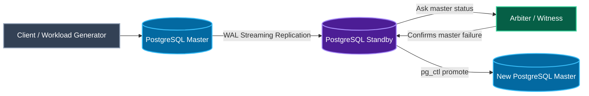
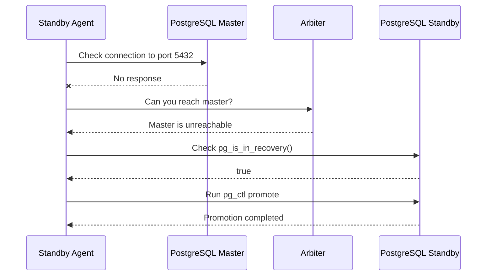
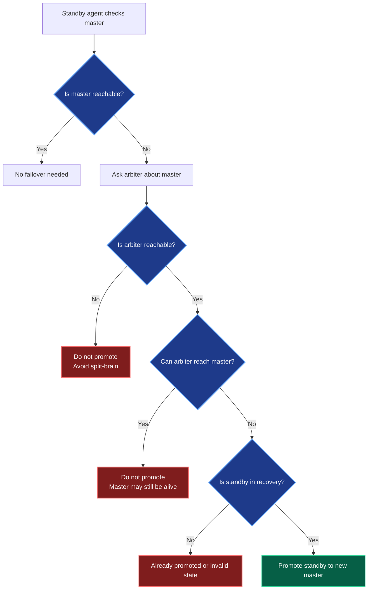
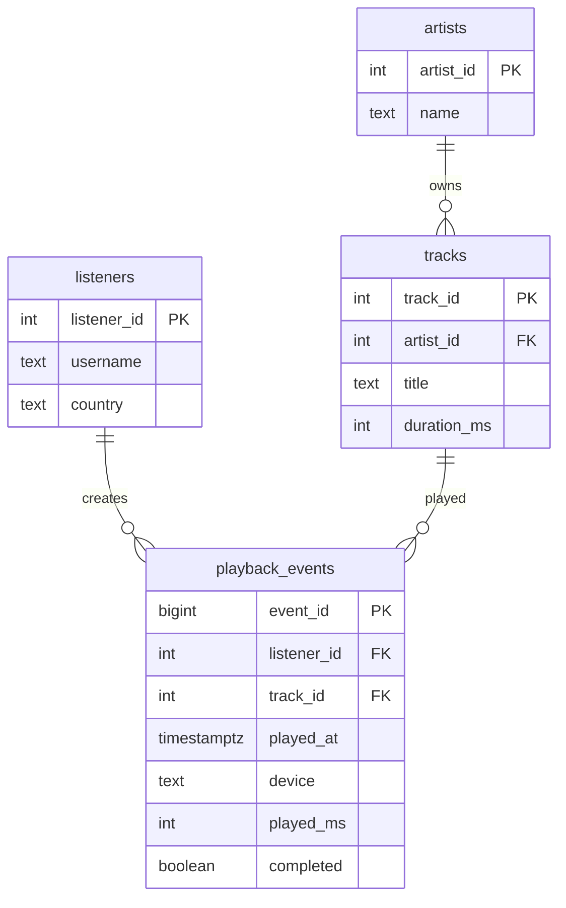
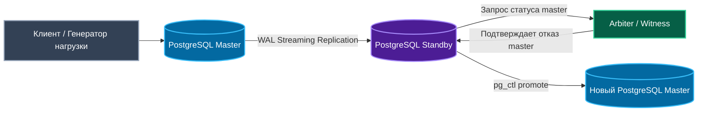
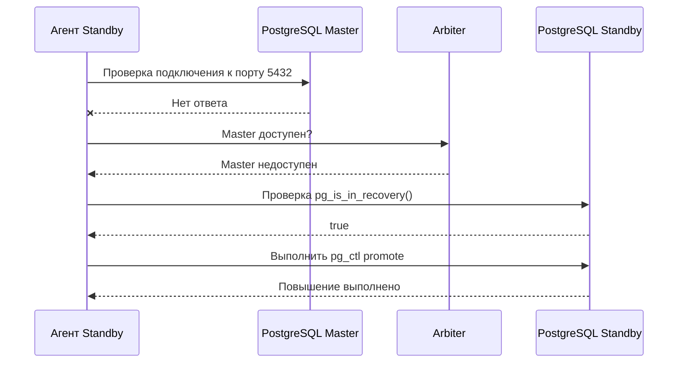
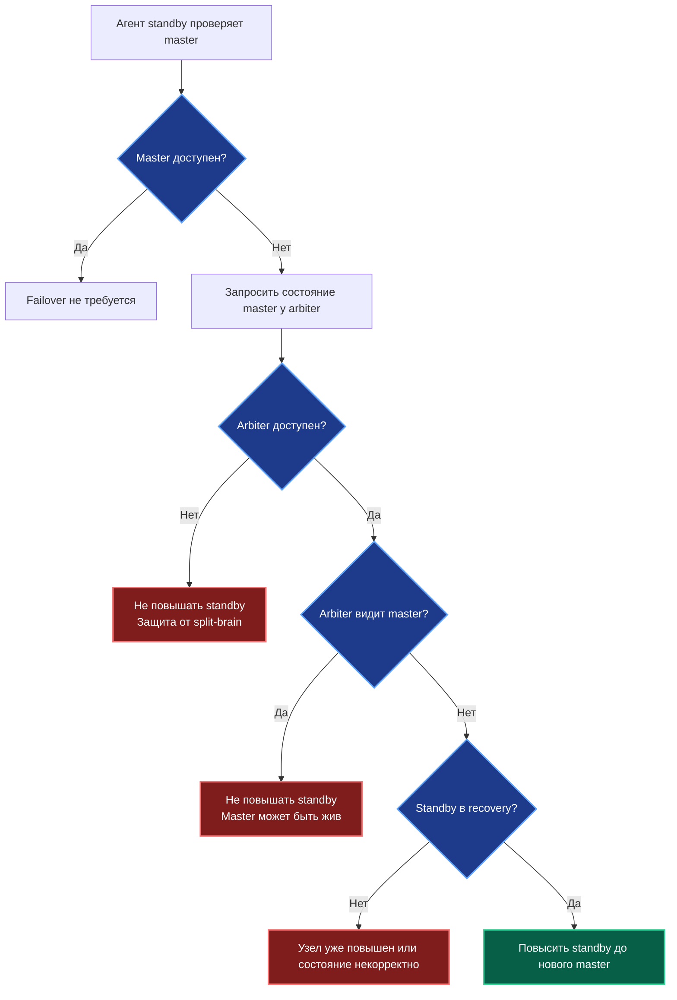

# MusicDB Failover Test

<p align="center">
  <b>PostgreSQL fault-tolerance laboratory project for a music streaming database</b><br>
  <b>Лабораторный проект по отказоустойчивости PostgreSQL для базы данных музыкального стриминга</b>
</p>

<p align="center">
  
  
  
  
</p>

---

## Language / Язык

| Language | Section |
|---|---|
| English | [English Version](#english-version) |
| Русский | [Русская версия](#русская-версия) |

---

# English Version

## 1. Project Theme

**Testing DBMS node failure in a music streaming system**

This project demonstrates a PostgreSQL fault-tolerance scenario for a simplified music streaming database.

The system contains:

| Object | Meaning |
|---|---|
| Listeners | Users of the music streaming service |
| Artists | Music creators |
| Tracks | Songs stored in the platform |
| Playback events | Synthetic listening events used as database workload |

The main purpose is to test how the database behaves when the main PostgreSQL node fails.

---

## 2. Project Mission

The mission is to build a small PostgreSQL cluster with:

| Node | Container | Role |
|---|---|---|
| Master | `pg_master` | Main writable PostgreSQL node |
| Standby | `pg_standby` | Replica that receives WAL changes |
| Arbiter | `pg_arbiter` | Witness node that helps decide whether failover is safe |

When the master fails, the standby must become the new master only after the arbiter confirms that the original master is unreachable.

This prevents **split-brain**, where two PostgreSQL nodes both become writable masters.

---

## 3. Architecture Diagram



---

## 4. Failover Sequence Diagram



---

## 5. Failover Decision Diagram



---

## 6. Database Model Diagram



---

## 7. Safe Promotion Rules

| Situation | Arbiter Result | Action |
|---|---|---|
| Standby cannot reach master | Arbiter also cannot reach master | Promote standby |
| Standby cannot reach master | Arbiter can reach master | Do not promote |
| Standby cannot reach master | Arbiter is unavailable | Do not promote |
| Master is reachable | Any | Do not promote |
| Standby is already promoted | Any | Do not promote again |

---

## 8. Technology Stack

| Technology | Purpose |
|---|---|
| PostgreSQL 16 | Database management system |
| Docker | Container runtime |
| Docker Compose | Multi-container cluster setup |
| Python 3.12 | Arbiter and failover agent |
| Bash | Helper scripts |
| Mermaid | Diagrams in README |
| GitHub | Source code hosting |

---

## 9. Repository Structure

```text
musicdb-failover-test/
├── README.md
├── docker-compose.yml
├── agent/
│   └── agent.py
├── assets/
│   └── banner.svg
├── docker/
│   ├── master/
│   │   └── init/
│   │       ├── 00-configure-master.sh
│   │       └── 01-music-schema.sql
│   └── standby/
│       └── standby-entrypoint.sh
└── scripts/
    ├── reset.sh
    ├── status.sh
    ├── test_failover.sh
    └── workload.sh
```

---

## 10. Services and Ports

| Service | Container Name | Host Port | Container Port | Purpose |
|---|---|---:|---:|---|
| PostgreSQL Master | `pg_master` | `5432` | `5432` | Primary database |
| PostgreSQL Standby | `pg_standby` | `5433` | `5432` | Replica database |
| Arbiter | `pg_arbiter` | `8000` | `8000` | Witness service |

---

## 11. Installation on Debian

Install required tools:

```bash
sudo apt update
sudo apt install -y git docker.io docker-compose-plugin python3
sudo systemctl enable --now docker
```

Allow the current user to use Docker without `sudo`:

```bash
sudo usermod -aG docker $USER
newgrp docker
```

Check versions:

```bash
git --version
docker --version
docker compose version
python3 --version
```

---

## 12. Start the Cluster

```bash
docker compose up -d
```

Check containers:

```bash
docker compose ps
```

Expected containers:

```text
pg_master
pg_standby
pg_arbiter
```

Check database and replication status:

```bash
./scripts/status.sh
```

---

## 13. Generate Synthetic Workload

Write playback events to the master database:

```bash
./scripts/workload.sh master 10
```

This simulates users listening to music from different devices.

| Device Type | Examples |
|---|---|
| Mobile | iOS, Android |
| Browser | Web |
| Smart device | Smart speaker |

---

## 14. Run Failover Test

```bash
./scripts/test_failover.sh
```

The test performs the following steps:

| Step | Action |
|---:|---|
| 1 | Insert playback events into master |
| 2 | Stop the master container |
| 3 | Run the failover agent |
| 4 | Ask arbiter to verify master failure |
| 5 | Promote standby |
| 6 | Insert new events into promoted standby |

Expected important output:

```text
Arbiter also cannot reach master. Promotion is safe.
Standby promotion command executed.
```

---

## 15. Verify Promotion

Check whether the standby is still in recovery mode:

```bash
docker exec -u postgres pg_standby psql -U postgres -d musicdb -c "SELECT pg_is_in_recovery();"
```

Expected result after promotion:

```text
f
```

Meaning:

| Result | Meaning |
|---|---|
| `t` | Node is still standby |
| `f` | Node is promoted and writable |

Test write operation:

```bash
docker exec -u postgres pg_standby psql -U postgres -d musicdb -c \
"INSERT INTO playback_events(listener_id, track_id, device, played_ms, completed)
 VALUES (1, 1, 'web', 120000, true);"
```

---

## 16. Useful Commands

| Command | Description |
|---|---|
| `docker compose up -d` | Start the cluster |
| `docker compose ps` | Show containers |
| `docker compose logs` | Show logs |
| `./scripts/status.sh` | Show replication status |
| `./scripts/workload.sh master 10` | Generate load on master |
| `./scripts/workload.sh standby 10` | Generate load on promoted standby |
| `./scripts/test_failover.sh` | Run failover test |
| `./scripts/reset.sh` | Remove containers and volumes |

---

## 17. Troubleshooting

### Docker permission denied

Error:

```text
permission denied while trying to connect to the Docker daemon socket
```

Fix:

```bash
sudo usermod -aG docker $USER
newgrp docker
docker ps
```

### No such container: pg_master

This means the cluster is not running.

Fix:

```bash
docker compose up -d
docker compose ps
```

### Standby was not promoted

Check arbiter:

```bash
curl http://127.0.0.1:8000/health
```

Check logs:

```bash
docker compose logs --tail=100
```

---

## 18. Expected Result

After the failover test:

| Component | Expected State |
|---|---|
| Master | Stopped |
| Standby | Promoted to new master |
| Arbiter | Confirms master failure |
| Workload | Continues on promoted standby |
| Database | Contains playback events before and after failover |

The project proves that PostgreSQL standby can become a writable master after a primary node failure when the arbiter confirms that promotion is safe.

---

# Русская версия

## 1. Тема проекта

**Тестирование отказа узла СУБД музыкального стриминга**

Проект демонстрирует сценарий отказоустойчивости PostgreSQL для упрощённой базы данных музыкального стриминга.

Система содержит:

| Объект | Значение |
|---|---|
| Слушатели | Пользователи музыкального сервиса |
| Исполнители | Авторы музыкальных треков |
| Треки | Песни, доступные в системе |
| События прослушивания | Синтетические события нагрузки |

Главная цель — проверить поведение базы данных при отказе основного узла PostgreSQL.

---

## 2. Миссия проекта

Миссия проекта — построить небольшой кластер PostgreSQL из трёх логических узлов:

| Узел | Контейнер | Роль |
|---|---|---|
| Master | `pg_master` | Основной узел PostgreSQL для записи |
| Standby | `pg_standby` | Реплика, получающая WAL-изменения |
| Arbiter | `pg_arbiter` | Узел-свидетель для принятия решения о failover |

Если master выходит из строя, standby должен стать новым master только после подтверждения от arbiter.

Это предотвращает ситуацию **split-brain**, когда два узла PostgreSQL одновременно становятся доступными для записи.

---

## 3. Диаграмма архитектуры



---

## 4. Диаграмма последовательности Failover



---

## 5. Диаграмма принятия решения



---

## 6. Диаграмма модели базы данных


---

## 7. Правила безопасного повышения

| Ситуация | Результат Arbiter | Действие |
|---|---|---|
| Standby не видит master | Arbiter тоже не видит master | Повысить standby |
| Standby не видит master | Arbiter видит master | Не повышать |
| Standby не видит master | Arbiter недоступен | Не повышать |
| Master доступен | Любой | Не повышать |
| Standby уже повышен | Любой | Не повышать повторно |

---

## 8. Используемые технологии

| Технология | Назначение |
|---|---|
| PostgreSQL 16 | Система управления базами данных |
| Docker | Среда запуска контейнеров |
| Docker Compose | Запуск нескольких контейнеров |
| Python 3.12 | Arbiter и failover-agent |
| Bash | Вспомогательные скрипты |
| Mermaid | Диаграммы в README |
| GitHub | Хранение исходного кода |

---

## 9. Структура репозитория

```text
musicdb-failover-test/
├── README.md
├── docker-compose.yml
├── agent/
│   └── agent.py
├── assets/
│   └── banner.svg
├── docker/
│   ├── master/
│   │   └── init/
│   │       ├── 00-configure-master.sh
│   │       └── 01-music-schema.sql
│   └── standby/
│       └── standby-entrypoint.sh
└── scripts/
    ├── reset.sh
    ├── status.sh
    ├── test_failover.sh
    └── workload.sh
```

---

## 10. Сервисы и порты

| Сервис | Контейнер | Порт хоста | Порт контейнера | Назначение |
|---|---|---:|---:|---|
| PostgreSQL Master | `pg_master` | `5432` | `5432` | Основная база данных |
| PostgreSQL Standby | `pg_standby` | `5433` | `5432` | Реплика базы данных |
| Arbiter | `pg_arbiter` | `8000` | `8000` | Узел-свидетель |

---

## 11. Установка на Debian

Установить необходимые инструменты:

```bash
sudo apt update
sudo apt install -y git docker.io docker-compose-plugin python3
sudo systemctl enable --now docker
```

Разрешить текущему пользователю использовать Docker без `sudo`:

```bash
sudo usermod -aG docker $USER
newgrp docker
```

Проверить версии:

```bash
git --version
docker --version
docker compose version
python3 --version
```

---

## 12. Запуск кластера

```bash
docker compose up -d
```

Проверить контейнеры:

```bash
docker compose ps
```

Ожидаемые контейнеры:

```text
pg_master
pg_standby
pg_arbiter
```

Проверить состояние базы данных и репликации:

```bash
./scripts/status.sh
```

---

## 13. Генерация синтетической нагрузки

Записать события прослушивания в master:

```bash
./scripts/workload.sh master 10
```

Это имитирует прослушивание музыки пользователями с разных устройств.

| Тип устройства | Примеры |
|---|---|
| Мобильное устройство | iOS, Android |
| Браузер | Web |
| Умное устройство | Smart speaker |

---

## 14. Запуск теста отказа

```bash
./scripts/test_failover.sh
```

Тест выполняет следующие шаги:

| Шаг | Действие |
|---:|---|
| 1 | Добавляет события прослушивания в master |
| 2 | Останавливает контейнер master |
| 3 | Запускает failover-agent |
| 4 | Запрашивает подтверждение отказа у arbiter |
| 5 | Повышает standby |
| 6 | Добавляет новые события в повышенный standby |

Ожидаемый важный вывод:

```text
Arbiter also cannot reach master. Promotion is safe.
Standby promotion command executed.
```

---

## 15. Проверка повышения Standby

Проверить, находится ли standby в режиме recovery:

```bash
docker exec -u postgres pg_standby psql -U postgres -d musicdb -c "SELECT pg_is_in_recovery();"
```

Ожидаемый результат после повышения:

```text
f
```

Значение:

| Результат | Значение |
|---|---|
| `t` | Узел всё ещё является standby |
| `f` | Узел повышен и доступен для записи |

Проверить операцию записи:

```bash
docker exec -u postgres pg_standby psql -U postgres -d musicdb -c \
"INSERT INTO playback_events(listener_id, track_id, device, played_ms, completed)
 VALUES (1, 1, 'web', 120000, true);"
```

---

## 16. Полезные команды

| Команда | Описание |
|---|---|
| `docker compose up -d` | Запустить кластер |
| `docker compose ps` | Показать контейнеры |
| `docker compose logs` | Показать логи |
| `./scripts/status.sh` | Показать состояние репликации |
| `./scripts/workload.sh master 10` | Создать нагрузку на master |
| `./scripts/workload.sh standby 10` | Создать нагрузку на повышенный standby |
| `./scripts/test_failover.sh` | Запустить тест отказа |
| `./scripts/reset.sh` | Удалить контейнеры и volumes |

---

## 17. Диагностика ошибок

### Ошибка Docker permission denied

Ошибка:

```text
permission denied while trying to connect to the Docker daemon socket
```

Исправление:

```bash
sudo usermod -aG docker $USER
newgrp docker
docker ps
```

### Ошибка No such container: pg_master

Это означает, что кластер ещё не запущен.

Исправление:

```bash
docker compose up -d
docker compose ps
```

### Standby не повысился

Проверить arbiter:

```bash
curl http://127.0.0.1:8000/health
```

Проверить логи:

```bash
docker compose logs --tail=100
```

---

## 18. Ожидаемый результат

После теста отказа:

| Компонент | Ожидаемое состояние |
|---|---|
| Master | Остановлен |
| Standby | Повышен до нового master |
| Arbiter | Подтвердил отказ master |
| Нагрузка | Продолжается на повышенном standby |
| База данных | Содержит события до и после failover |

Проект показывает, что standby-узел PostgreSQL может стать новым master-узлом для записи после отказа основного узла, если arbiter подтверждает безопасность повышения.

---

## License / Лицензия

Educational project for studying DBMS fault tolerance.

Учебный проект для изучения отказоустойчивости СУБД.
# MusicDB Failover Test

<p align="center">
  <b>PostgreSQL fault-tolerance laboratory project for a music streaming database</b><br>
  <b>Лабораторный проект по отказоустойчивости PostgreSQL для базы данных музыкального стриминга</b>
</p>

<p align="center">
  
  
  
  
</p>

---

## Language / Язык

| Language | Section |
|---|---|
| English | [English Version](#english-version) |
| Русский | [Русская версия](#русская-версия) |

---

# English Version

## 1. Project Theme

**Testing DBMS node failure in a music streaming system**

This project demonstrates a PostgreSQL fault-tolerance scenario for a simplified music streaming database.

The system contains:

| Object | Meaning |
|---|---|
| Listeners | Users of the music streaming service |
| Artists | Music creators |
| Tracks | Songs stored in the platform |
| Playback events | Synthetic listening events used as database workload |

The main purpose is to test how the database behaves when the main PostgreSQL node fails.

---

## 2. Project Mission

The mission is to build a small PostgreSQL cluster with:

| Node | Container | Role |
|---|---|---|
| Master | `pg_master` | Main writable PostgreSQL node |
| Standby | `pg_standby` | Replica that receives WAL changes |
| Arbiter | `pg_arbiter` | Witness node that helps decide whether failover is safe |

When the master fails, the standby must become the new master only after the arbiter confirms that the original master is unreachable.

This prevents **split-brain**, where two PostgreSQL nodes both become writable masters.

---

## 3. Architecture Diagram


---

## 4. Failover Sequence Diagram


---

## 5. Failover Decision Diagram


---

## 6. Database Model Diagram


---

## 7. Safe Promotion Rules

| Situation | Arbiter Result | Action |
|---|---|---|
| Standby cannot reach master | Arbiter also cannot reach master | Promote standby |
| Standby cannot reach master | Arbiter can reach master | Do not promote |
| Standby cannot reach master | Arbiter is unavailable | Do not promote |
| Master is reachable | Any | Do not promote |
| Standby is already promoted | Any | Do not promote again |

---

## 8. Technology Stack

| Technology | Purpose |
|---|---|
| PostgreSQL 16 | Database management system |
| Docker | Container runtime |
| Docker Compose | Multi-container cluster setup |
| Python 3.12 | Arbiter and failover agent |
| Bash | Helper scripts |
| Mermaid | Diagrams in README |
| GitHub | Source code hosting |

---

## 9. Repository Structure

```text
musicdb-failover-test/
├── README.md
├── docker-compose.yml
├── agent/
│   └── agent.py
├── assets/
│   └── banner.svg
├── docker/
│   ├── master/
│   │   └── init/
│   │       ├── 00-configure-master.sh
│   │       └── 01-music-schema.sql
│   └── standby/
│       └── standby-entrypoint.sh
└── scripts/
    ├── reset.sh
    ├── status.sh
    ├── test_failover.sh
    └── workload.sh
```

---

## 10. Services and Ports

| Service | Container Name | Host Port | Container Port | Purpose |
|---|---|---:|---:|---|
| PostgreSQL Master | `pg_master` | `5432` | `5432` | Primary database |
| PostgreSQL Standby | `pg_standby` | `5433` | `5432` | Replica database |
| Arbiter | `pg_arbiter` | `8000` | `8000` | Witness service |

---

## 11. Installation on Debian

Install required tools:

```bash
sudo apt update
sudo apt install -y git docker.io docker-compose-plugin python3
sudo systemctl enable --now docker
```

Allow the current user to use Docker without `sudo`:

```bash
sudo usermod -aG docker $USER
newgrp docker
```

Check versions:

```bash
git --version
docker --version
docker compose version
python3 --version
```

---

## 12. Start the Cluster

```bash
docker compose up -d
```

Check containers:

```bash
docker compose ps
```

Expected containers:

```text
pg_master
pg_standby
pg_arbiter
```

Check database and replication status:

```bash
./scripts/status.sh
```

---

## 13. Generate Synthetic Workload

Write playback events to the master database:

```bash
./scripts/workload.sh master 10
```

This simulates users listening to music from different devices.

| Device Type | Examples |
|---|---|
| Mobile | iOS, Android |
| Browser | Web |
| Smart device | Smart speaker |

---

## 14. Run Failover Test

```bash
./scripts/test_failover.sh
```

The test performs the following steps:

| Step | Action |
|---:|---|
| 1 | Insert playback events into master |
| 2 | Stop the master container |
| 3 | Run the failover agent |
| 4 | Ask arbiter to verify master failure |
| 5 | Promote standby |
| 6 | Insert new events into promoted standby |

Expected important output:

```text
Arbiter also cannot reach master. Promotion is safe.
Standby promotion command executed.
```

---

## 15. Verify Promotion

Check whether the standby is still in recovery mode:

```bash
docker exec -u postgres pg_standby psql -U postgres -d musicdb -c "SELECT pg_is_in_recovery();"
```

Expected result after promotion:

```text
f
```

Meaning:

| Result | Meaning |
|---|---|
| `t` | Node is still standby |
| `f` | Node is promoted and writable |

Test write operation:

```bash
docker exec -u postgres pg_standby psql -U postgres -d musicdb -c \
"INSERT INTO playback_events(listener_id, track_id, device, played_ms, completed)
 VALUES (1, 1, 'web', 120000, true);"
```

---

## 16. Useful Commands

| Command | Description |
|---|---|
| `docker compose up -d` | Start the cluster |
| `docker compose ps` | Show containers |
| `docker compose logs` | Show logs |
| `./scripts/status.sh` | Show replication status |
| `./scripts/workload.sh master 10` | Generate load on master |
| `./scripts/workload.sh standby 10` | Generate load on promoted standby |
| `./scripts/test_failover.sh` | Run failover test |
| `./scripts/reset.sh` | Remove containers and volumes |

---

## 17. Troubleshooting

### Docker permission denied

Error:

```text
permission denied while trying to connect to the Docker daemon socket
```

Fix:

```bash
sudo usermod -aG docker $USER
newgrp docker
docker ps
```

### No such container: pg_master

This means the cluster is not running.

Fix:

```bash
docker compose up -d
docker compose ps
```

### Standby was not promoted

Check arbiter:

```bash
curl http://127.0.0.1:8000/health
```

Check logs:

```bash
docker compose logs --tail=100
```

---

## 18. Expected Result

After the failover test:

| Component | Expected State |
|---|---|
| Master | Stopped |
| Standby | Promoted to new master |
| Arbiter | Confirms master failure |
| Workload | Continues on promoted standby |
| Database | Contains playback events before and after failover |

The project proves that PostgreSQL standby can become a writable master after a primary node failure when the arbiter confirms that promotion is safe.

---

# Русская версия

## 1. Тема проекта

**Тестирование отказа узла СУБД музыкального стриминга**

Проект демонстрирует сценарий отказоустойчивости PostgreSQL для упрощённой базы данных музыкального стриминга.

Система содержит:

| Объект | Значение |
|---|---|
| Слушатели | Пользователи музыкального сервиса |
| Исполнители | Авторы музыкальных треков |
| Треки | Песни, доступные в системе |
| События прослушивания | Синтетические события нагрузки |

Главная цель — проверить поведение базы данных при отказе основного узла PostgreSQL.

---

## 2. Миссия проекта

Миссия проекта — построить небольшой кластер PostgreSQL из трёх логических узлов:

| Узел | Контейнер | Роль |
|---|---|---|
| Master | `pg_master` | Основной узел PostgreSQL для записи |
| Standby | `pg_standby` | Реплика, получающая WAL-изменения |
| Arbiter | `pg_arbiter` | Узел-свидетель для принятия решения о failover |

Если master выходит из строя, standby должен стать новым master только после подтверждения от arbiter.

Это предотвращает ситуацию **split-brain**, когда два узла PostgreSQL одновременно становятся доступными для записи.

---

## 3. Диаграмма архитектуры


---

## 4. Диаграмма последовательности Failover


---

## 5. Диаграмма принятия решения


---

## 6. Диаграмма модели базы данных


---

## 7. Правила безопасного повышения

| Ситуация | Результат Arbiter | Действие |
|---|---|---|
| Standby не видит master | Arbiter тоже не видит master | Повысить standby |
| Standby не видит master | Arbiter видит master | Не повышать |
| Standby не видит master | Arbiter недоступен | Не повышать |
| Master доступен | Любой | Не повышать |
| Standby уже повышен | Любой | Не повышать повторно |

---

## 8. Используемые технологии

| Технология | Назначение |
|---|---|
| PostgreSQL 16 | Система управления базами данных |
| Docker | Среда запуска контейнеров |
| Docker Compose | Запуск нескольких контейнеров |
| Python 3.12 | Arbiter и failover-agent |
| Bash | Вспомогательные скрипты |
| Mermaid | Диаграммы в README |
| GitHub | Хранение исходного кода |

---

## 9. Структура репозитория

```text
musicdb-failover-test/
├── README.md
├── docker-compose.yml
├── agent/
│   └── agent.py
├── assets/
│   └── banner.svg
├── docker/
│   ├── master/
│   │   └── init/
│   │       ├── 00-configure-master.sh
│   │       └── 01-music-schema.sql
│   └── standby/
│       └── standby-entrypoint.sh
└── scripts/
    ├── reset.sh
    ├── status.sh
    ├── test_failover.sh
    └── workload.sh
```

---

## 10. Сервисы и порты

| Сервис | Контейнер | Порт хоста | Порт контейнера | Назначение |
|---|---|---:|---:|---|
| PostgreSQL Master | `pg_master` | `5432` | `5432` | Основная база данных |
| PostgreSQL Standby | `pg_standby` | `5433` | `5432` | Реплика базы данных |
| Arbiter | `pg_arbiter` | `8000` | `8000` | Узел-свидетель |

---

## 11. Установка на Debian

Установить необходимые инструменты:

```bash
sudo apt update
sudo apt install -y git docker.io docker-compose-plugin python3
sudo systemctl enable --now docker
```

Разрешить текущему пользователю использовать Docker без `sudo`:

```bash
sudo usermod -aG docker $USER
newgrp docker
```

Проверить версии:

```bash
git --version
docker --version
docker compose version
python3 --version
```

---

## 12. Запуск кластера

```bash
docker compose up -d
```

Проверить контейнеры:

```bash
docker compose ps
```

Ожидаемые контейнеры:

```text
pg_master
pg_standby
pg_arbiter
```

Проверить состояние базы данных и репликации:

```bash
./scripts/status.sh
```

---

## 13. Генерация синтетической нагрузки

Записать события прослушивания в master:

```bash
./scripts/workload.sh master 10
```

Это имитирует прослушивание музыки пользователями с разных устройств.

| Тип устройства | Примеры |
|---|---|
| Мобильное устройство | iOS, Android |
| Браузер | Web |
| Умное устройство | Smart speaker |

---

## 14. Запуск теста отказа

```bash
./scripts/test_failover.sh
```

Тест выполняет следующие шаги:

| Шаг | Действие |
|---:|---|
| 1 | Добавляет события прослушивания в master |
| 2 | Останавливает контейнер master |
| 3 | Запускает failover-agent |
| 4 | Запрашивает подтверждение отказа у arbiter |
| 5 | Повышает standby |
| 6 | Добавляет новые события в повышенный standby |

Ожидаемый важный вывод:

```text
Arbiter also cannot reach master. Promotion is safe.
Standby promotion command executed.
```

---

## 15. Проверка повышения Standby

Проверить, находится ли standby в режиме recovery:

```bash
docker exec -u postgres pg_standby psql -U postgres -d musicdb -c "SELECT pg_is_in_recovery();"
```

Ожидаемый результат после повышения:

```text
f
```

Значение:

| Результат | Значение |
|---|---|
| `t` | Узел всё ещё является standby |
| `f` | Узел повышен и доступен для записи |

Проверить операцию записи:

```bash
docker exec -u postgres pg_standby psql -U postgres -d musicdb -c \
"INSERT INTO playback_events(listener_id, track_id, device, played_ms, completed)
 VALUES (1, 1, 'web', 120000, true);"
```

---

## 16. Полезные команды

| Команда | Описание |
|---|---|
| `docker compose up -d` | Запустить кластер |
| `docker compose ps` | Показать контейнеры |
| `docker compose logs` | Показать логи |
| `./scripts/status.sh` | Показать состояние репликации |
| `./scripts/workload.sh master 10` | Создать нагрузку на master |
| `./scripts/workload.sh standby 10` | Создать нагрузку на повышенный standby |
| `./scripts/test_failover.sh` | Запустить тест отказа |
| `./scripts/reset.sh` | Удалить контейнеры и volumes |

---

## 17. Диагностика ошибок

### Ошибка Docker permission denied

Ошибка:

```text
permission denied while trying to connect to the Docker daemon socket
```

Исправление:

```bash
sudo usermod -aG docker $USER
newgrp docker
docker ps
```

### Ошибка No such container: pg_master

Это означает, что кластер ещё не запущен.

Исправление:

```bash
docker compose up -d
docker compose ps
```

### Standby не повысился

Проверить arbiter:

```bash
curl http://127.0.0.1:8000/health
```

Проверить логи:

```bash
docker compose logs --tail=100
```

---

## 18. Ожидаемый результат

После теста отказа:

| Компонент | Ожидаемое состояние |
|---|---|
| Master | Остановлен |
| Standby | Повышен до нового master |
| Arbiter | Подтвердил отказ master |
| Нагрузка | Продолжается на повышенном standby |
| База данных | Содержит события до и после failover |

Проект показывает, что standby-узел PostgreSQL может стать новым master-узлом для записи после отказа основного узла, если arbiter подтверждает безопасность повышения.

---

## License / Лицензия

Educational project for studying DBMS fault tolerance.

Учебный проект для изучения отказоустойчивости СУБД.
